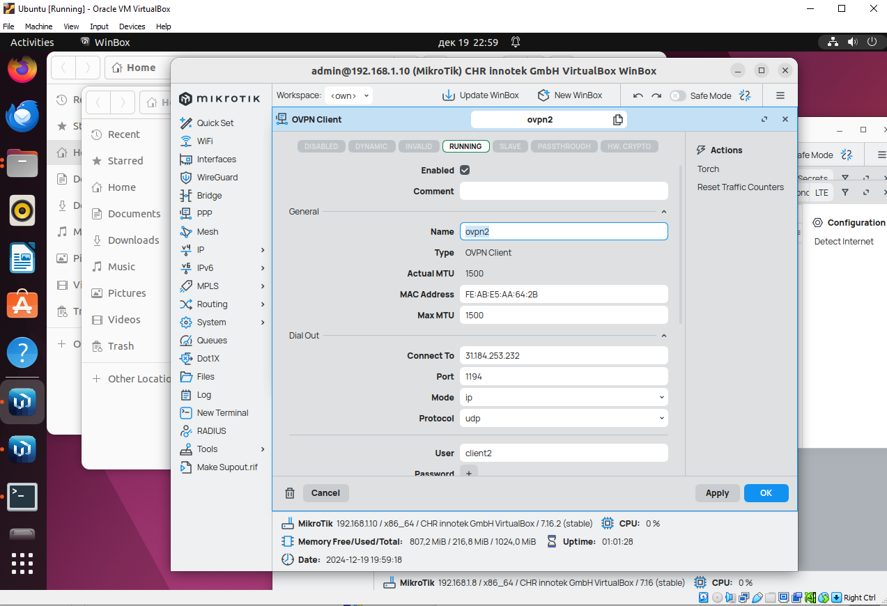

University: [ITMO University](https://itmo.ru/ru/)  
Faculty: [FICT](https://fict.itmo.ru)  
Course: [Network programming](https://github.com/itmo-ict-faculty/network-programming)  
Year: 2024/2025  
Group: K34212  
Author: Roman Deineko  
Lab: Lab2  
Date of create: 27.12.2024  
Date of finished: 27.12.2024  

## Лабораторная работа №2 "Развертывание дополнительного CHR, первый сценарий Ansible"

## <a name="section1">Цель работы</a>
С помощью Ansible настроить несколько сетевых устройств и собрать информацию о них. Правильно собрать файл Inventory.
## <a name="section2">Ход работы</a>

Аналогично первой лабораторной работе была создана ВМ на базе CHR. Далее к ней было осуществлено подключение через openvpn.

Соединение было успешно установлено, все устройства связаны друг с другом.

Для подключения к роутерам по ssh был создан и импортирован новый ssh-ключ.

После этого сервер позволяет нам свободно подключаться к клиентам.

Далее для работы с Ansible в отдельной директории была создана директория Inventory и файл hosts со списком устройств. В результате с клиентами установлена связь.

Затем была установлена библиотека ansible-pylibssh для работы с ssh в Ansible.

Для реализации основного задания был создан playbook с описанием необходимых задач. В данном случае на обоих роутерах в результате исполнения yaml-файла были обновлены пароли, а также добавлен NTP client для установки точного времени на основе данных с NTP-серверов.

Далее сценарий был перенастроен для реализации OSPF на роутерах: создана основная зона backbone с идентификатором 0.0.0.0, в нее добавлены оба роутера с идентификаторами 1.1.1.1 и 3.3.3.3, а между ними - ptp соединение. Также в правилах firewall был разрешен трафик, связанный с мультикаст-адресом 224.0.0.5, который используется для пересылки OSPF-пакетов.

Далее возникла проблема с доставкой OSPF-пакета "Hello" от одного роутера другому, вследствие чего соседство между ними не было установлено. В результате добавления в конфигурацию сервера строчки client-to-client пакеты начали доходить.

## <a name="section3">Вывод</a>

В ходе выполнения данной лабораторной работы был настроен OSPF через OpenVPN на MikroTik, NTP Client и авторизация с помощью Ansible.
