University: [ITMO University](https://itmo.ru/ru/)  
Faculty: [FICT](https://fict.itmo.ru)  
Course: [Network programming](https://github.com/itmo-ict-faculty/network-programming)  
Year: 2024/2025  
Group: K34212  
Author: Deineko Roman  
Lab: Lab3  
Date of create: 14.01.2025  
Date of finished: 14.01.2025  

## Лабораторная работа №3 "Развертывание Netbox, сеть связи как источник правды в системе технического учета Netbox"

## <a name="section2">Цель работы</a>
С помощью Ansible и Netbox собрать всю возможную информацию об устройствах и сохранить их в отдельном файле.

## <a name="section3">Ход работы</a>
Перед установкой самого Netbox необходимо провести подготовительные работы. На новой машине был установлен postgresql, создана БД и пользователь netbox. 

<p align="center">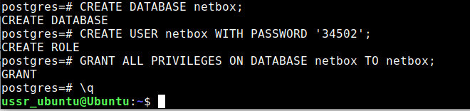</p>

<p align="center">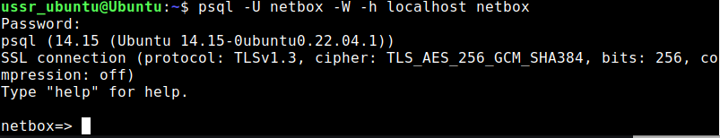</p>

Затем было развернуто хранилище Redis, используемое Netbox. Проверка связи показывает, что Redis активен.

<p align="center">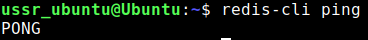</p>

Далее с гита был склонирован репозиторий Netbox.

<p align="center">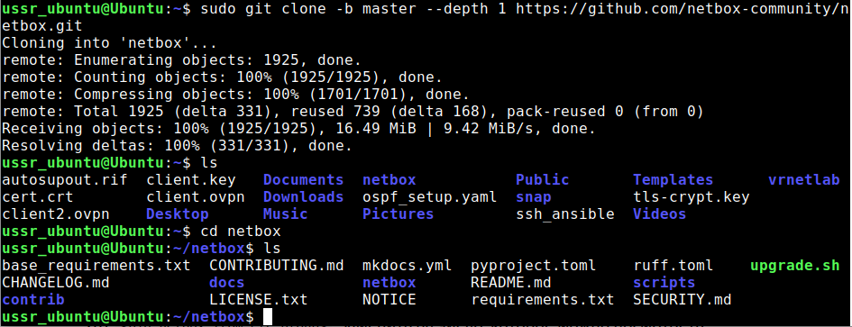</p>

Настройки configuration.py были изменены (добавлен localhost, изменен часовой пояс, добавлен сгенерированный секретный ключ). Для создания виртуальной среды со всеми необходимыми пакетами python и объединения статических файлов был запущен встроенный скрипт upgrade.sh.

<p align="center">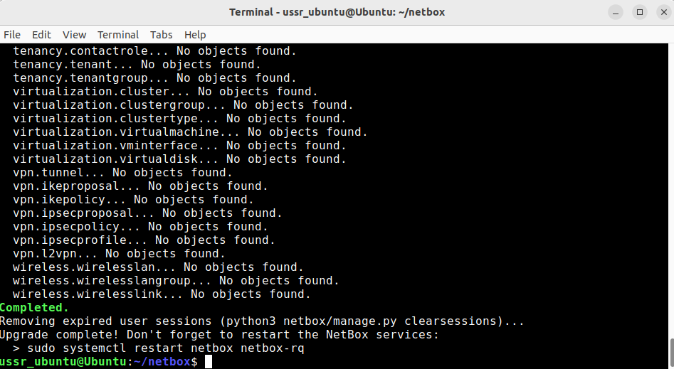</p>

Далее был произведен вход в виртуальную среду, после чего создан суперпользователь.

<p align="center">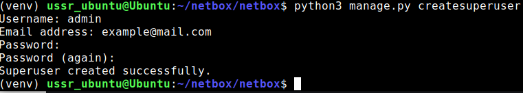</p>

В качестве проверки был произведен вход на localhost:8000, на котором открывается Netbox.

<p align="center">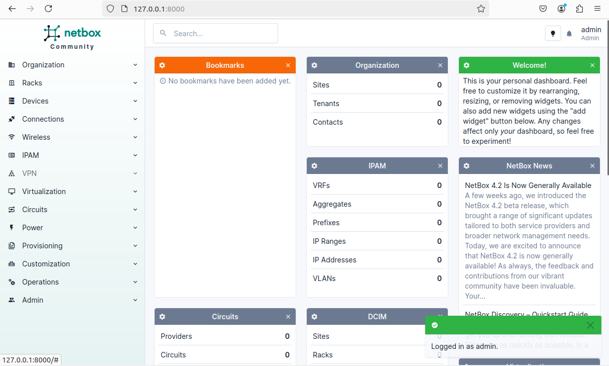</p>

Для дальнейшей работы был настроен gunicorn и nginx. Так как изначально все ставилось в папку пользователя машины, а не в /opt, пришлось изменить пути по умолчанию в конфигурационных файлах. По итогу сервис Netbox запущен.

<p align="center">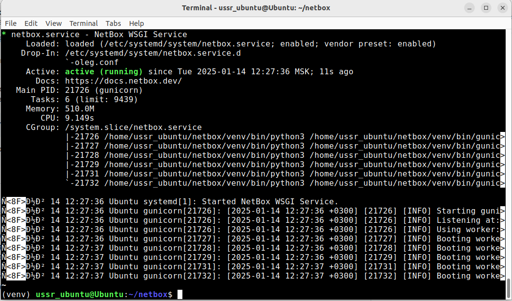</p>

<p align="center">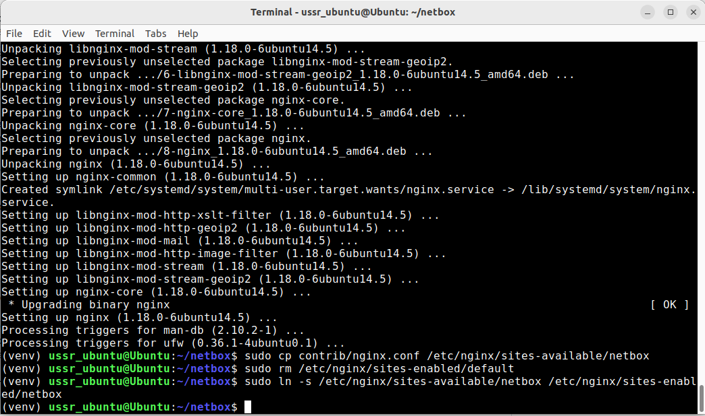</p>

Далее в Netbox были созданы устройства с предварительно добавленными сайтом, типом, ролью, производителем и платформой (Позднее для работы с Ansible будет добавлен серийный номер и primary ip). Данная информация будет выводиться в дальнейшем с помощью Ansible.

<p align="center">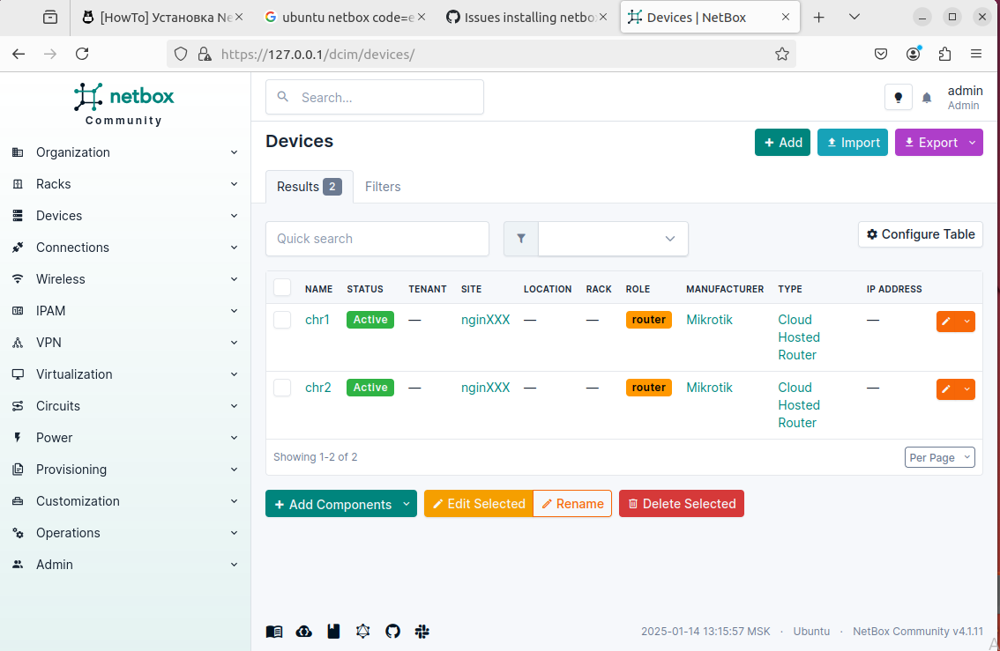</p>

Для работы с Ansible была создана отдельная директория и развернута новая виртуальная среда.

<p align="center">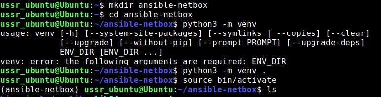</p>

Затем после установки нескольких необходимых пакетов (pylibssh, pytz) был создан файл netbox_inventory.yml для добавления Netbox в инвентарь Ansible и отображения информации об устройствах. API Токен был предварительно сгенерирован в Netbox.

```yaml
---
plugin: netbox.netbox.nb_inventory
api_endpoint: https://127.0.0.1:443/
token: ...
validate_certs: False
config_context: False
```

<p align="center">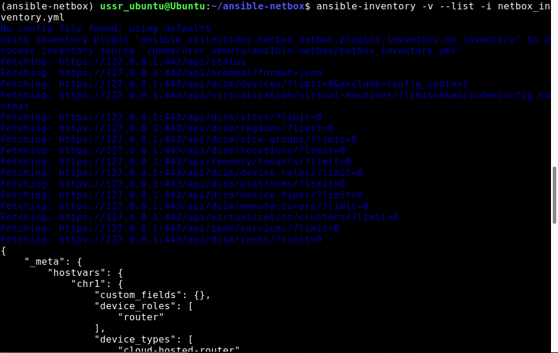</p>

Результат выполнения файла netbox_inventory.yml был записан в inventory_output.json.

<p align="center">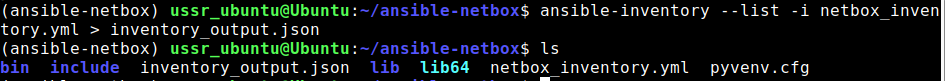</p>

Дальнейшие операции производились через плейбук netbox_main.yml. Конфигурация, указанная ниже, помимо вывода информации об устройствах и записи ее в файл netbox_devices.json также меняет имена устройств.

```yaml
---
- name: Gather device information including interfaces and IPs from NetBox
  hosts: localhost
  connection: local
  gather_facts: false
  vars:
    netbox_url: "https://127.0.0.1:443"
    netbox_token: ...

  tasks:
    - name: Get all devices from NetBox
      uri:
        url: "{{ netbox_url }}/api/dcim/devices/"
        headers:
          Authorization: "Token {{ netbox_token }}"
        validate_certs: false
        return_content: true
      register: devices_response

    - name: Get interfaces for each device and combine with devices
      uri:
        url: "{{ netbox_url }}/api/dcim/?device={{ item.id }}/interfaces"
        headers:
          Authorization: "Token {{ netbox_token }}"
        validate_certs: false
        return_content: true
      register: interfaces_response
      loop: "{{ devices_response.json.results }}"
      loop_control:
        loop_var: item
      # when: devices_response.json.results is defined

    - name: Build a list of devices with their interfaces
      set_fact:
        devices_with_interfaces: "{{ devices_with_interfaces | default([]) + [{'device': item, 'interfaces': interfaces_response.json.results | default([])}] }}"
      loop: "{{ devices_response.json.results }}"
      loop_control:
        loop_var: item
      # when: interfaces_response is defined and interfaces_response.json is defined

    - name: Save devices and interfaces to JSON file
      copy:
        dest: netbox_devices.json
        content: "{{ devices_with_interfaces | to_json | indent(2) }}"

    - name: Update device names
          uri:
            url: "{{ netbox_url }}/api/dcim/devices/{{ item.id }}/"
            method: PATCH
            headers:
              Authorization: "Token {{ netbox_token }}"
              Content-Type: "application/json"
            body: >
              {
                "name": "{{ item.new_name }}"
              }
            body_format: json
            validate_certs: false
          loop:
            - { id: 1, new_name: "MyCHR1" }
            - { id: 2, new_name: "MyCHR2" }

```

<p align="center">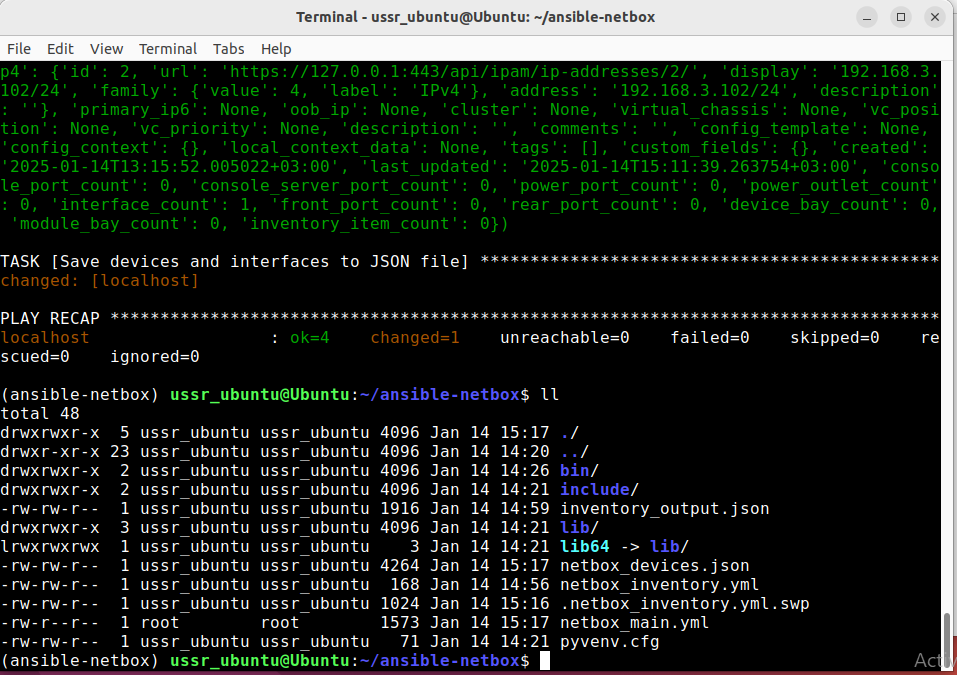</p>

<p align="center">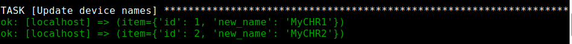</p>

Последним шагом выступает сбор серийного номера каждого устройства. Для этого в netbox_main.yml были добавлены новые таски.

```yaml
- name: Gather serial number from MikroTik devices
      community.routeros.command:
        commands:
          - "/system license print"
      register: result

    - name: Extract serial numbers
      set_fact:
        serial_numbers: "{{ serial_numbers | default([]) + [ item | regex_replace('system-id: (\\S+).*', '\\1') ] }}"
      loop: "{{ result.stdout_lines | select('search', 'system-id:') | list }}"
      loop_control:
        loop_var: item

    - name: Show extracted serial numbers in terminal
      debug:
        msg: "{{ serial_numbers }}"

    - name: Update devices in NetBox with serial numbers
      uri:
        url: "{{ netbox_url }}/api/dcim/devices/{{ item.id }}/"
        method: PATCH
        headers:
          Authorization: "Token {{ netbox_token }}"
          Content-Type: "application/json"
        body_format: json
        body:
          serial: "{{ serial_numbers[loop.index0] }}" 
        validate_certs: false
      loop: "{{ ansible_play_hosts }}"  
      loop_control:
        loop_var: item
      register: netbox_update_result

    - name: Show NetBox update result
      debug:
        var: netbox_update_result

```


## <a name="section4">Вывод</a>

В ходе работы был настроен сервис Netbox, созданы устройства, отображающие роутеры из лабораторной работы №2. Также было настроено взаимодействие Ansible с Netbox для чтения и записи информации об устройствах в обе стороны.
